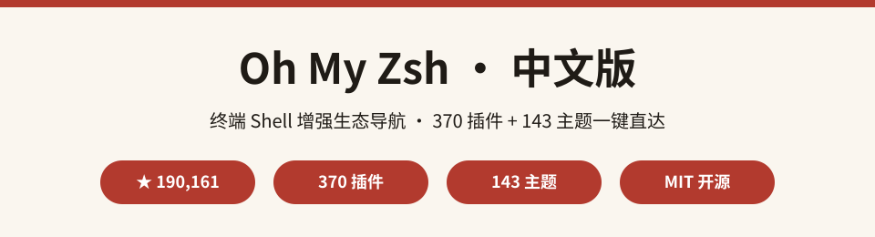
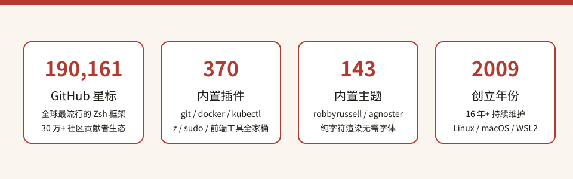

  

# Oh My Zsh 中文版

> **全球最流行的 Zsh 配置增强框架 · 中文生态导航**
>
> 源自 GitHub 上 **190,000+ ★** 的 [ohmyzsh/ohmyzsh](https://github.com/ohmyzsh/ohmyzsh)，收录 **370 个内置插件 + 143 个内置主题**的完整生态索引，安装、配置、换肤、插件全家桶一键直达，让你的终端从「能用」变成「好用」。

---

⭐ 如果对你有帮助，点个 Star 支持中文开源

## 目录

- [这是什么？](#这是什么)
- [为什么值得收藏](#为什么值得收藏)
- [数据一览](#数据一览)
- [快速开始](#快速开始)
- [分类清单](#分类清单)
- [全量索引](#全量索引)
- [完整数据](#完整数据)
- [常见问题 FAQ](#常见问题-faq)
- [参与贡献](#参与贡献)
- [致谢](#致谢)
- [许可声明](#许可声明)

---

## 这是什么？

**Oh My Zsh 中文版** 是对全球最流行的 Zsh 配置增强框架 [ohmyzsh/ohmyzsh](https://github.com/ohmyzsh/ohmyzsh) 的中文二次开发项目。

源项目由 Robby Russell 创建于 **2009 年**，提供一套开箱即用的 Zsh 配置框架：**数百个插件**（git 快捷命令、Docker、Kubernetes、npm 全家桶……）、**150+ 主题**（纯字符渲染、无需额外字体），配合自动更新、社区 wiki 与 30 万+ 贡献者生态，是全球终端用户装机量最大的 Shell 增强方案。

**中文版做了什么：**

- 🗂️ 把源仓 **370 个插件 + 143 个主题** 全量提取为中文索引（[plugins-index.md](plugins-index.md)），按字母序排列，插件名即目录名、点开直达源仓；
- ⚡ 在本 README 精选 **24 个高频插件 + 12 个热门主题**，配中文译名 + 一句话功能说明；
- 📖 提炼「三步上手」安装配置指引与 FAQ，让你从零开始把终端武装到牙齿。

## 为什么值得收藏

- 🚀 **终端效率拉满**：git / z / autojump / docker / kubectl / fzf / zoxide……高频工具全部插件化，一条命令搞定；
- 🎨 **143 款主题任选**：robbyrussell / agnoster / bira / candy……纯字符渲染，远程服务器也能用；
- ⚡ **极简上手**：curl 一行命令装好，`.zshrc` 改两行启用插件与主题；
- 🔄 **自动更新**：默认每两周提示一次更新，`omz update` 一键升级；
- 🌍 **生态巨大**：Linux / macOS / WSL2 全平台支持，社区 wiki 与 30 万+ 贡献者持续维护；
- 🇨🇳 **中文友好**：全量索引 + 精选译名 + 上手指引，英文文档也不再劝退。

## 数据一览

  

> 数字全部来自源仓 [README.md](https://github.com/ohmyzsh/ohmyzsh/blob/master/README.md) 与 GitHub Git Trees API 实际统计（星数 GitHub 实测；插件/主题数按 `plugins/` 与 `themes/` 目录逐条计数，2026-10-05 核实）。

## 快速开始

### 三步上手

  

1. **安装**：终端执行 `sh -c "$(curl -fsSL https://raw.githubusercontent.com/ohmyzsh/ohmyzsh/master/tools/install.sh)"`；
2. **启用插件**：编辑 `~/.zshrc`，把想用的插件名（如 `git docker kubectl`）写进 `plugins=(...)` 列表；
3. **切换主题**：把 `ZSH_THEME="robbyrussell"` 改成你喜欢主题的名字（如 `agnoster`），重开终端即刻换肤。

### 示例：装好立刻能用的 git 插件

启用 `git` 插件后，`gst` = `git status`、`gaa` = `git add --all`、`gcmsg` = `git commit -m`、`gl` = `git pull`，日常 Git 操作从此一只手搞定。

## 分类清单

精选 **24 个高频插件**（完整 370 个见 [plugins-index.md](plugins-index.md)）：

| 插件名 | 中文译名 | 一句话功能 |
| --- | --- | --- |
| git | Git 快捷键 | gst/gaa/gcmsg 等高频 Git 别名 |
| z | 高频目录跳转 | 记住访问过的目录，一键跳转 |
| autojump | 智能目录跳转 | 按权重直达常去目录 |
| docker | Docker 助手 | docker 命令补全与别名 |
| docker-compose | Compose 助手 | docker-compose 别名与补全 |
| kubectl | Kubernetes 助手 | kubectl 补全 + k 别名 + 上下文提示 |
| helm | Helm 助手 | Helm 包管理器补全 |
| terraform | Terraform 助手 | IaC 工具补全与别名 |
| aws | AWS 助手 | aws cli 补全、profiles 切换 |
| gh | GitHub CLI | gh 命令补全与别名 |
| fzf | 模糊查找 | Ctrl+R 历史模糊搜索 |
| zoxide | 智能 cd 替代 | 学习习惯目录，z 查询直达 |
| zsh-syntax-highlighting | 语法高亮 | 命令输入即高亮，防手误 |
| zsh-autosuggestions | 命令自动建议 | 灰字提示历史命令补全 |
| vi-mode | Vi 编辑模式 | 终端输入切 Vi 键位 |
| sudo | sudo 前缀 | 行首双击 Esc 补 sudo |
| command-not-found | 命令提示 | 敲错命令给出安装建议 |
| history | 历史增强 | 历史命令搜索与统计 |
| extract | 一键解压 | 识别压缩格式自动解压 |
| web-search | 网页搜索 | 终端直接搜索 Google/Bing |
| npm | npm 助手 | npm 补全与别名 |
| pip | pip 助手 | Python 包管理器补全 |
| python | Python 助手 | pyenv/虚拟环境整合 |
| tmux | tmux 助手 | tmux 别名与补全 |

精选 **12 个热门主题**（完整 143 个见 [plugins-index.md](plugins-index.md)）：

| 主题名 | 中文译名 | 风格特点 |
| --- | --- | --- |
| robbyrussell | 默认主题 | 简洁稳定，默认即用 |
| agnoster | 经典终端风 | 分段提示符，需 Powerline 字体 |
| bira | 双行信息 | 用户名+目录+Git 分支 |
| candy | 糖果风 | 色彩明快的双行主题 |
| clean | 极简风 | 最小干扰，专注命令 |
| fishy | Fish 风格 | 模仿 fish shell 的提示符 |
| gnzh | 中文友好 | 用户名高亮，兼容性好 |
| kennethreitz | 极客风 | 作者同款，信息密度高 |
| lambda | Lambda 风 | 双行、带 Git 状态 |
| minimal | 最小化 | 一行提示符，最省空间 |
| sorin | 分区块 | 模块化区块式提示符 |
| ys | 双行精简 | 用户+路径+Git 分支 |

## 全量索引

📄 **[plugins-index.md](plugins-index.md)** — 收录源仓全部 **370 个插件**（按字母序）与 **143 个主题**（按字母序）的完整名单，插件名/主题名即源仓对应目录，点开即用。

## 完整数据

- 📦 源仓库：[ohmyzsh/ohmyzsh](https://github.com/ohmyzsh/ohmyzsh)（默认分支 `master`，MIT License）
- 👤 作者：Robby Russell 及社区贡献者（[contributors](https://github.com/ohmyzsh/ohmyzsh/contributors)），由 Planet Argon 团队发起
- 🌐 官方资源：官网 [ohmyz.sh](https://ohmyz.sh) / 插件 wiki / 主题 wiki / Discord 社区
- 📄 源 README（英文原文）：[README.md](https://github.com/ohmyzsh/ohmyzsh/blob/master/README.md)

## 常见问题 FAQ

**Q1：我没有 Zsh，能装吗？**

先装 Zsh（`zsh --version` 确认，版本建议 5.0.8+），再执行安装命令；Windows 用户请用 WSL2。

**Q2：插件怎么启用？**

编辑 `~/.zshrc`，在 `plugins=(...)` 里加上插件名（空格分隔，**不要用逗号**），保存后重开终端即可。每个内置插件都带 README 说明。

**Q3：主题需要装字体吗？**

多数主题不需要；但 agnoster 等花哨主题建议安装 Powerline 或 Nerd Font，否则符号会显示异常。

**Q4：装了 Oh My Zsh 会覆盖我的配置吗？**

安装脚本会把原 `~/.zshrc` 重命名为 `.zshrc.pre-oh-my-zsh` 备份，自定义内容可在新 `.zshrc` 里迁移。

**Q5：这个中文版和源项目是什么关系？**

本项目是中文**生态索引与导读**，框架、插件、主题都在源项目。插件/主题名即源仓目录名，实际使用请安装源项目。

## 参与贡献

- 🐛 发现译名或索引错误：提 Issue；
- 🌐 补充 / 修正插件与主题中文译名：Fork 后修改 [plugins-index.md](plugins-index.md) 提 PR；
- 📝 分享你的终端配置心得：欢迎在 Issue 交流。

## 致谢

- 感谢 [Robby Russell](https://github.com/robbyrussell) 与全体贡献者（[contributors](https://github.com/ohmyzsh/ohmyzsh/graphs/contributors)）打造并长期维护这套伟大的终端框架；
- 感谢 30 万+ 社区贡献者共建插件与主题生态；
- 感谢每一位正在把终端武装到牙齿的你 🌟

## 许可声明

- 本仓库代码与文档：**MIT License**（见 [LICENSE](LICENSE)，Copyright (c) 2026 zieang88888）；
- 源项目 [ohmyzsh/ohmyzsh](https://github.com/ohmyzsh/ohmyzsh)：**MIT License**（Copyright (c) 2009-2022 Robby Russell and contributors）；
- 第三方声明与完整署名见 [THIRD_PARTY_NOTICES.md](THIRD_PARTY_NOTICES.md)。

## 姊妹项目

中文开源矩阵，一网打尽开发者的知识库：

- [zhskills · 中文技能库](https://github.com/zieang88888/zhskills)
- [awesome-ai-tools-zh · AI 工具导航](https://github.com/zieang88888/awesome-ai-tools-zh)
- [free-programming-books-zh · 编程书籍大全](https://github.com/zieang88888/free-programming-books-zh)
- [system-design-zh · 系统设计面试](https://github.com/zieang88888/system-design-zh)
- [awesome-python-zh · Python 生态导航](https://github.com/zieang88888/awesome-python-zh)
- [llm-course-zh · LLM 课程导航](https://github.com/zieang88888/llm-course-zh)
- [design-resources-for-developers-zh · 设计资源大全](https://github.com/zieang88888/design-resources-for-developers-zh)
